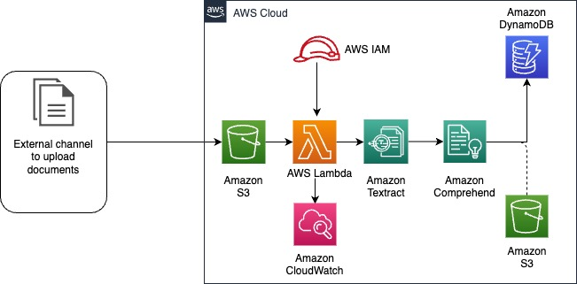

# Extract Personal Identifiable Information (PII) with Amazon Textract and Comprehend

To extract PII data from documents, customers usually need to manually extract and look for specific data from diverse input documents.

## Solution Overview

This sample sets up a **document processing pipeline** orchestrated by serverless offerings from Amazon, as shown below:

Documents uploaded to the input bucket automatically trigger AWS Lambda, which:

1. Extracts document data using Amazon Textract.
2. Pass on the output of Amazon Textract to Amazon Comprehend.
3. Comprehend detects any PII data and makes an entry into Amazon DynamoDB. Customers can also use Amazon S3 to store the output of Comprehend.
4. Customers can apply analytics on DynamoDB or S3 data to gain insights.

## Getting Started

To deploy this sample you'll need access to your target AWS Account with sufficient *permissions* to deploy the various resources created by the solution (which includes IAM resources).

- Step 1 - git clone **the repository**
- Step 2 - Open AWS Management Console and from the search bar open the service, AWS CloudFormation.
- Step 3 - Create a new stack and upload the cloudformation template file *amazon-textract-comprehend-pii-analysis-cloudformation-template.yaml*. 
- Step 4 - The template file accepts 4 parameters as shown below:

| Sr No | Parameter name         | Parameter Description and sample value                                                                                                         | From where to fetch the value | 
| ------ |------------------------|------------------------------------------------------------------------------------------------------------------------------------------------|-------------------------------|
| 1 | AWSRegion              | Value of AWS region where the solution is to be deployed. e.g. us-east-1                                                                       | user-entered                          |
| 2	| EnvName                | Value of target environment for tagging. e.g. dev. test. prod                                                                                  | user-entered                          |
| 3	| ResultDynamoDBTableName       | Value of the DynamoDB table where the Comprehend processing results are to be stored. e.g. pii-data                                            | user-entered                          |
| 4	| SrcBucketName | Value of the Source S3 bucket name where the documents, that needs to be processed, is to be uploaded. e.g. s3-source-sink                     | user-entered                  |

- Step 6 - Acknowledge that the CloudFormation template creates AWS IAM resources and deploy the template.
- Step 7 - After the deployment and resource creation is complete, go to AWS management console and search for S3. 
- Step 8 - Search for the name of S3 bucket that was provided as the parameter *SrcBucketName* in the CloudFormation template,
- Step 9 - Upload some documents (supported formats are PNG, JPEG, TIFF, and PDF).
- Step 10 - From the AWS management console, go to DynamoDB and search for the table (with the name that was provided as a parameter *ResultDynamoDBTableName* in the CloudFormation template).
- Step 11 - The table would be populated with entries related to the document uploaded.

## Next Steps

For this demo we have a use-case to detect if PII data is present in an uploaded document. We also demonstrated that, the processed data stored in 
DynamoDB can be used for gaining insights and analytics purposes.

As next steps, developers can export the processed data into S3 bucket and integrate it with data analytics offerings.

## Security

See [CONTRIBUTING](CONTRIBUTING.md#security-issue-notifications) for more information.

## License

This library is licensed under the MIT-0 License. See the [LICENSE](LICENSE) file. Included annotation datasets are licensed under the Creative Commons Attribution 4.0 International License. See the [notebooks/data/annotations/LICENSE](notebooks/data/annotations/LICENSE) file.
